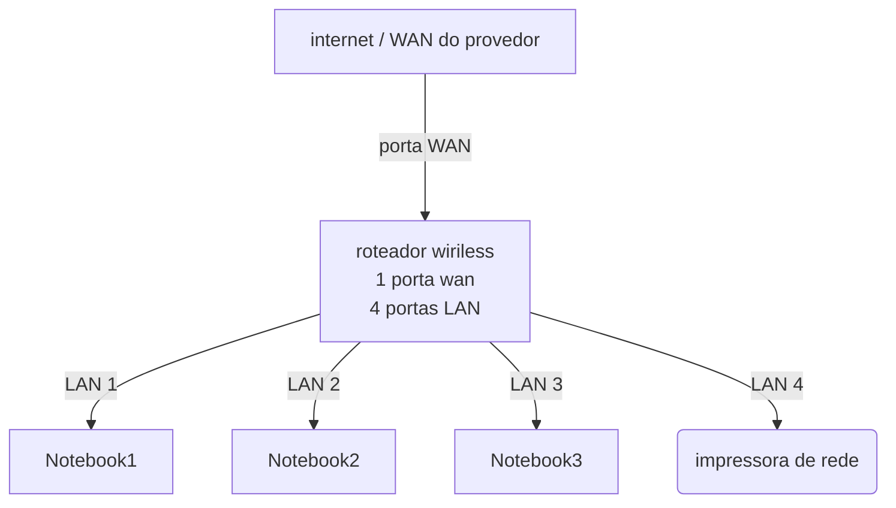

# Laboratório de redes 01 - Projeto de rede local
Projeto desenvolvido na diciplina de Redes de computadores no Curso Tecnico de Informática do SENAC 
---
Aluno: Taylor Santos 

Professor: José de Assis

data: 09/03/2026

## 1. Objetivo
Implementar uma rede local simples, conectando 3 notebooks a um roteador wiriless com switch integrado a uma impressora de rede

O projeto será realizado em duas etapas:
1. Simulação da rede no Cisco Packet Tracer
2. Implementação da rede no laboratório real

---
## 2. Equipamentos utilizados neste laboratório
- 3 notebooks
- 1 roteador wiriless com 4 portas LAN
- 1 impressora de rede
- cabos de rede

---
## 3. Diagrama lógico da rede utilizado neste laboratório

---
rede: 192.168.0.0/24
Gateway: 192.168.0.1
| Dispositivo | Tipo de IP | Endereço de IP | Observação | 
|-------------|------------|---------------|-----------|
|Roteador | Estatico | 192.16 8.0.1 |ip do roteador |
| Impressora | reserva DHCP | 192.16 8.0.1| IP reservado do roteador |
| PC1 | Reserva | DHCP | Automático | IP reservado do roteador
| PC2 | Reserva | DHCP | Automático | IP reservado do roteador
| PC3 | Reserva | DHCP | Automático | IP reservado do roteador

**Observação**
- A impressora e um dos notebooks utilição reserva DHCP.
- O roteador sempre atribui o mesmo IP a esses dispositivos

---

##5. implementação no laboratório real 

Após a instalação, a rede foi montada físicamente no laboratório

Etapas realizadas: (capturas de tela realizadas durante o labboratório)

Testes: (capturas de tela realizadas durante o labboratório)

 ## 6. Conclusão
 -Este laboratório permitiu compreender o funcionamento de uma rede local simples, incluindo:
 - Estrutura de uma rede doméstica ou de pequenos escritórios
 - Utilização de um roteador com a porta WAN e portas LAN
 - Comunicação entre dispositivos na rede local
 - Utilização de uma impressora de rede
 - Compartilhamento de pastas na rede  
